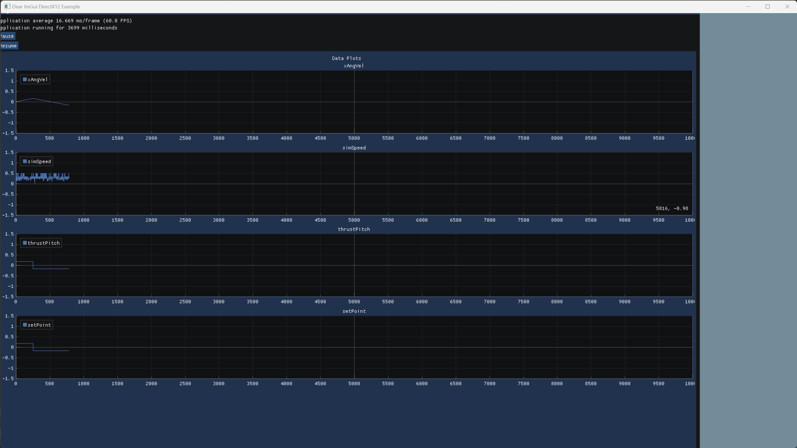

# DataLog
This is a statically accessible Data logging library intended for simulation systems. Log from anywhere in your code, and get updated Plots and CSV files automatically.

# Features
 - Static interface to push a data point, a timestamp, or a control message
 - UI That provides realtime plotting, running in a separate thread
   - Plots are added as new data columns are added. 
   - Plots are synced in the x-axis for easy comparison
 - Live CSV writer - Generates the csv on the fly, including support for a dynamic set of variables
 - Performance optimized - The library uses an optimized threading structure along with optimized data structures for max throughput
 - Automatically computes the simulation speed in realtime
 - Provides controls to pause/resume the simulation

# Installing
This library depends on ImGui and ImPlot. Both libraries must first be installed into your project before this library can be used. However, they are only required for the UI component, and can easily be stripped away if you are only interested in the csv functionality. 

Once those are installed, it is as simple as dropping all the files into your source structure and including DataLog.h wherever needed.

# Usage
The library exposes 7 public methods:
- initialize(str filename) - this must be caled prior to anything else. It starts the UI and csv logger. If you do not call this first, they will not start and nothing will be logged.
- logData(str name, double value) - this logs a named datapoint. You can call this many times without issue
- pushTimestamp(double ts) - this collects all the data points logged since the last timestamp and puts them together to be logged.
- pushEvent(EventType event, str message) - this is mainly used to trigger pause, resume, and stop functionality. 
- isDone / isPaused - return whether the user has stopped / paused the run
- cleanup() - cleanup - closes the plot ui and csv logger.

## Demo code

```{C++}
#include "DataLog.h"

int main() {
    DataLog::initialize("Data.csv");

    long simTimeMs = 0;
    long value = 7;
    while (!DataLog::isDone()) {
        if (DataLog::isPaused()) continue;
        value += (value % 3);
        DataLog::logData("Value", value);
        DataLog::pushTimestamp(simTimeMs);

    }
    DataLog::cleanup();

}

```

## Thread Safety
In its current form, it is designed for a single thread generating data. However, this can easily be modified by substituting the readerwriterqueue for the [Concurrent queue](https://github.com/cameron314/concurrentqueue), which is conviently by the same author as the readerwriter. 

# UI Demo


# Structure
The library spawns three Separate threads
- One that ingests and reformats data for the UI and CSV
- One that runs the UI
- One that runs the CSVwriter

The flow is as follows:
- You call logData. The datapoint is added to a map in the datalog class
- You call push timestamp - the data from the map is added to an object contianing it and the simulation timestamp. THis is pushed to a concurrent queue. The local map is cleared
- The data ingestion thread dequeues from the map and reformats into appropriate forms for the UI and csv
    - for the UI: This is a map of the variable to two lists of values for x and y
    - For the CSV - Just gets pushed to the CSV's queue
- The UI thread loads those arrays into ImPlot
- The CSV thread dequeues row-by-row from its own queue and writes to the specified file. The ehader is dynamically updated as more columns are added.

# License and dependencies
Please see the LICENSE file for more info on the license of this project.

Additionally, It relies on the following dependencies and awesome projects:

- [readerwriterqueue](https://github.com/cameron314/readerwriterqueue)
- [ImPlot](https://github.com/epezent/implot)
- [ImGUI](https://github.com/ocornut/imgui)